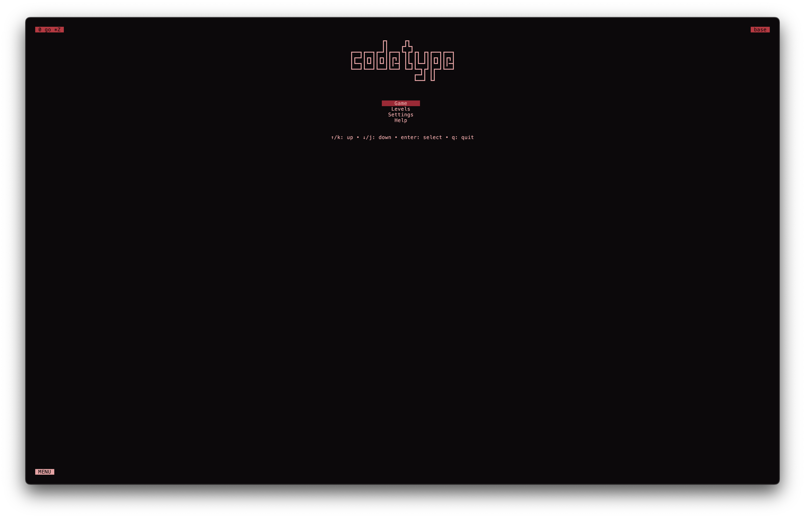

# gotype

*A terminal-based typing test for programmers, written in Go.*

---

## Overview

**gotype** is a fast, minimalist typing test built for programmers who want to practice typing code-like text inside the terminal.  
It’s inspired by tools like [monkeytype](https://monkeytype.com/), but designed for the command line.  

- Written in **Go** for performance and portability  
- Built with [Charm’s Bubble Tea](https://github.com/charmbracelet/bubbletea) TUI framework  
- Code-focused word lists (not just everyday text)  
- Works directly in your terminal  
* uses vim-like keybindings 

---

## Contribution
Contributions, issues, and feature requests are welcome!
Make sure to read [Contributor's Guide]( /docs/contributions.md )
Feel free to open a PR or [create an issue]( https://github.com/joshua-Evans-1/gotype/issues )

